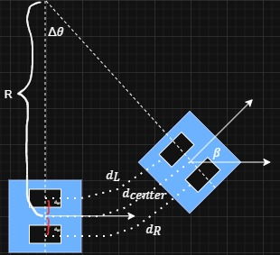
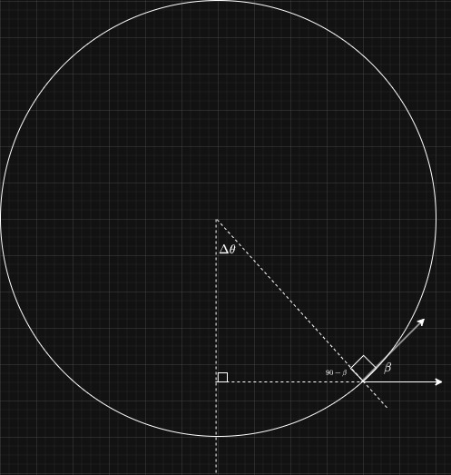
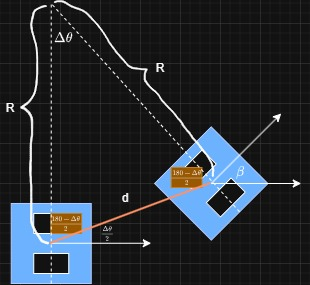

## Odometry
Our odometry methodology utilize wheel encoder and IMU to estimate how far the mobile robot has moved from a certain point. The wheel encoder provide the information about how far has the wheel rotated in radians. To approximate the distance of each wheel we can apply the following formula
$$
d = radians \times wheel radius
$$
However, this does not necessarily give us the distance of the mobile robot. This is because when a mobile robot rotated to a certain direction, the encoder from each wheel will give different value. Therefore, to get the distance, we average the distance from left wheel encoder and right wheel encoder.
$$
d_{center} = \frac{(d_{L} + d_{R})}{2}
$$

The delta theta of the yaw could be calculated using the following schematic

The variables from the picture above can be described as follow:
- $d_L =$ The distance travelled by the left wheel
- $d_R =$ The distance travelled by the right wheel
- $d_{center} =$ The distance travelled by the mobile robot
- $d_w =$ The distance between the wheel and the center of the mobile robot
- $R =$ The radius from the imaginary anchor to the mobile robot.
- $\Delta\theta =$ The angular displacement from the original point to the displacement
- $\beta =$ The angular displacement of the yaw of the mobile robot

Based on the schematic above, we assume the turning mobile robot follows a circular path with radius $R$ and the yaw is tangent to the circular path. Therefore, to find the yaw $\beta$ we can do it by finding $\Delta\theta$. The reason can be described from the simplified schematic below where we focused on the circular path. 

From the simplified geometry above, we can proof that the $\beta$ is equal to $\Delta\theta$ by the following work
$$
180 = \Delta\theta + 90 + (90 - \beta) \\
\Delta\theta = 180 - 90 - (90 - \beta) \\
\Delta\theta = 180 - 90 - 90 + \beta \\
\Delta\theta = \beta
$$

After we know that the $\beta$ can be found by finding $\Delta\theta$, next we need to find the $\Delta\theta$ itself. Back to the original schematic,

we can leverage the $R$, $\Delta\theta$, $d_L$, and $d_R$ to find our target value, which can be written as follow

First we write the two equation of $d_L$ and $d_R$ as follow
$$
d_L = (R - d_w) \times \Delta\theta \\
d_R = (R + d_w) \times \Delta\theta \\
$$

Second, we eliminate the unknown value $R$ by subtracting both equation with each other
$$
d_L = (R - d_w) \times \Delta\theta \\
d_R = (R + d_w) \times \Delta\theta \\
....................................... - \\
d_L - d_R = (- d_w - d_w) \times \Delta\theta \\
d_L - d_R = -2d_w \times \Delta\theta \\
\Delta\theta = \frac{d_R - d_L}{2d_w}
$$
Hence, we found the $\Delta\theta$ value. This method is used if you want to find the yaw approximation through the wheel encoder. However, our approach use directly from the IMU sensor which has been localized first.

The reason we need to find the yaw ($\beta$) or $\Delta\theta$ in the first place can be understanded from the following diagram

Since odometry is about approximating how far and where an object has moved from an anchor position, we need to find out the approximation of the distance travelled by the object both in x and y axis. From the diagram above, it can be seen that the distance imaginary line forming an isosceles triangle. To find the distance traveled both in the x and y axis we can utilize the angle between the original orientation of the mobile robot and the direction of the displacement.

After we found the angle, we use it to calculate the displacement both in x and y axis using sine or cosine of the angle. We also assume that the $d$ here is approximated to $d_{center}$.
$$
x_{new} = x_{old} + (d \times cos(\Delta\theta)) \\
y_{new} = y_{old} + (d \times sin(\Delta\theta))
$$

From all of the process we acquire our updated coordinate ($x_{new}$, $y_{new}$), and the yaw $\beta$.

## Pure pursuit

We implement the pure pursuit algorithm based on the theory found in the documentation [here](https://thomasfermi.github.io/Algorithms-for-Automated-Driving/Control/PurePursuit.html)